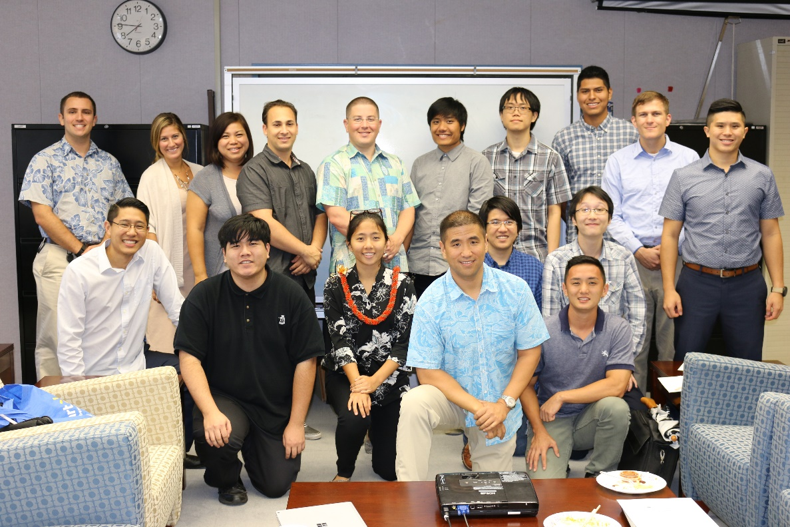

  

In the summer of 2016 I Interned with the state to help create Hawaii's first Hawaii Annual Code Challenge. 
This was a month long event that is similar to a hackathon that would help Hawaii and give it's local tech talent 
an opportunity to work together to tackle Hawaii's problems and find and implement possible solutions

During the internship the group of interns were placed into seperate teams. I was placed into two teams, one was the web desgin team, 
so we focused on building and managing the website through WordPress using HTML, CSS, and PHP. While the other team was a small team 
that was myself and a state worker, where we researched web accessibility in hopes that we can improve the layout of the state's many sites.
Making it easier for people to navigate and find answers to their questions about the state. We also tried modifying the hacc website to follow 
web accessibility rules, which we tested with [WAVE](http://wave.webaim.org/) and [tenon.io](https://tenon.io/)

Through this internship, I got a feel of what it is like to work with the state, and most importantly a little look at what 
a possible web designer job could be like. 

HACC Website: [Click Here](http://hacc.hawaii.gov/)

About HACC Event: [Click Here](http://ets.hawaii.gov/state-transformation-internship-program-wraps-up-summer-2016-session/)
