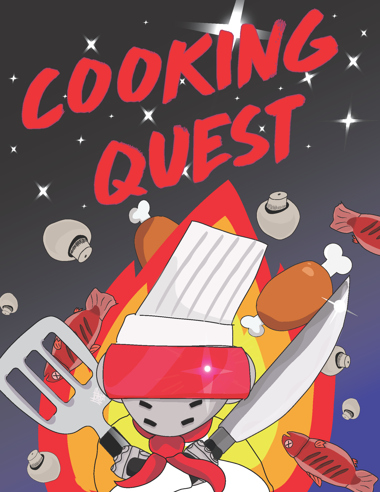

In my ics 313 class, we created a text-based games using Lisp. These games would be an open world where you can interact with objects and you the player of the game has to figure out a way to win while playing the game by typing in commands. 

My game was a game where the player is a robotic cooking knight that would fight the monsters in the area. The knight would do that by finding items and combing and cooking them, causing the monsters to be put into submission from the knight's delicious creations. 

This project was really fun and important to me, because it was the closest thing to a videogame I have ever made, which is one of my goals. This project was also the first time, I have ever really tried to draw using Adobe Illustrator. It made me realize how fun and time consuming drawing is. 

My Project: [Click Here](https://github.com/lancenhd/cookingQuest/blob/new_branch/cookingQuest/cooking_quest.lisp)
