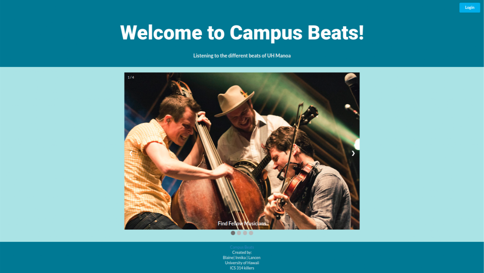
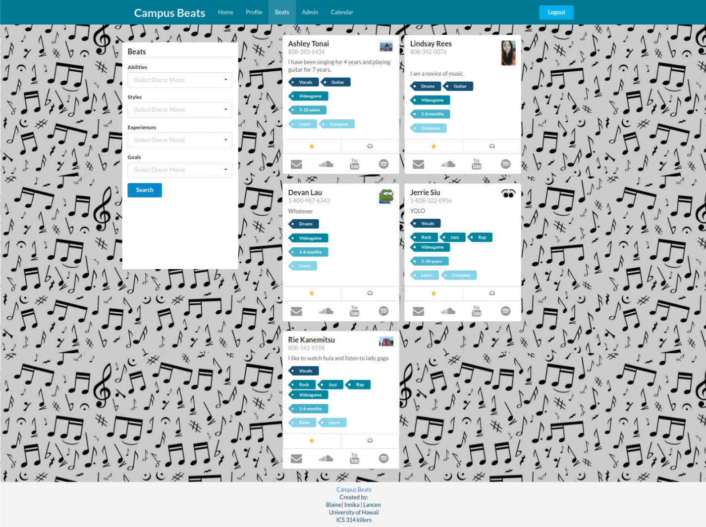
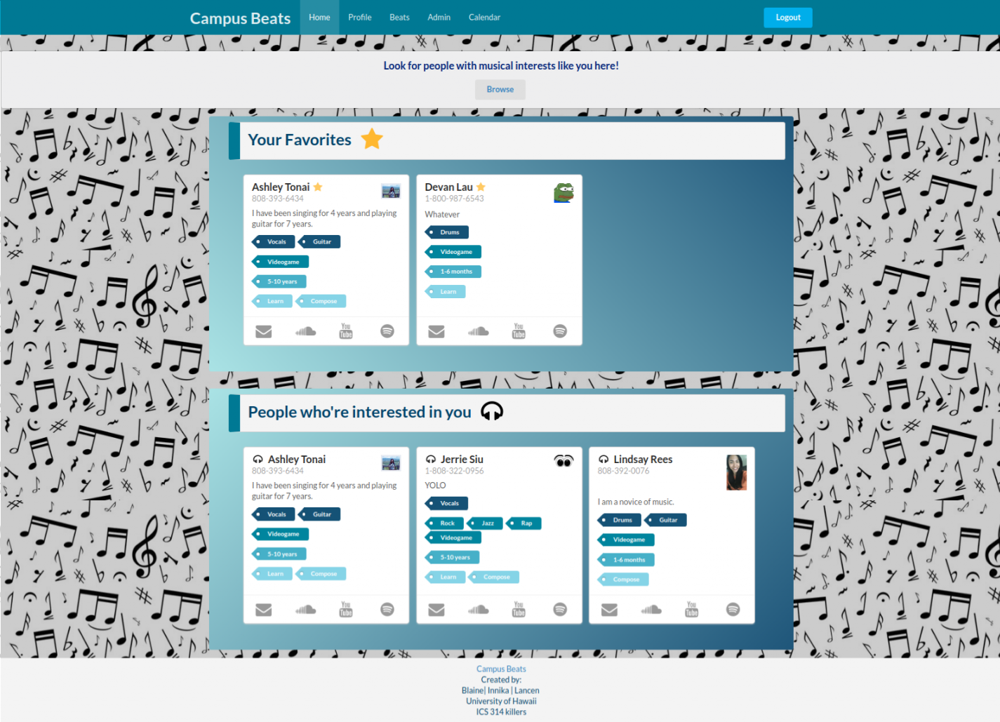

## About Campus Beats
  
  Campus Beats is the final project for ics 314 (software engineering) that Blaine Wataru, Innika Pang, and I worked on together. 
  Campus Beats is an app that allows people who are interested in music to reach out and meet with other like minded and talented people to play music with each other. 
  This idea is very helpful in my opinion. For example a possible problem with someone who wants to make a band is meeting people, because not eveyone can devote their 
  time to learning an instrument, and just because they play an instrument doesn't mean it won't mesh well with yourself. This could be for reasons 
  like the genre of music people like to play, or even their experience. With the Campus Beats app, you can filter and find people that you would like to work with
  such as by finding people with similar goals, styles, experience, and abilities.
  
  You can view the project [HERE](https://github.com/campusbeats).
  
## Reflection 
  After working on this project, I feel like I have gained a better understanding of team work, the different stages of planning and production, github, 
  and programming with a team. Luckily, I was fortunate enough to work with good natured people, where ideas were passed freely and without fear of discrimination. 
  We also talked out problems that we were having, enabling  us to get rid of several of our issues for the project such as the sorting algortihm for our beats page, 
  which was agreed to be one of the most important functions of our app. 
  
  However, one of the problems that did happen early on, which I am glad to have experienced was mixing together code with people, through GitHub.
  I felt comfortable with github when I was working on my own projects by myself, but once other people was involved things got complicated. 
  An example of this was merging in the master branch, because code was overwritten and we had to back track through commits to figure out what 
  was modified. However, after maybe about a week of this struggle, the workflow for github was smoother,and we functioned better. Since I was working 
  in a team I also felt I had to step up my game, and keep up with my team. I usually code at a slower pace, so with them, I feel like I was able to improve on
  that issue.
  
  Through github, we also learned about managing projects, through issues that can be split into parts that people can be assigned, so people know what to do. 
  And by planning we were able to better map out our actions. After spending so long  finding a way to get the search algorithm we actually didn't know how to tackle 
  the rest of the functionalities such as admin functionalites, so we went back to planning to talk about possible ways we could code it. 
  
  Although we weren't able to get all of our functions to work like we originally wanted, we were able to get most of it and I believe 
  that with more time we could have finished the project with fully working functionalites. 
  
## My Contribution 
  For this project we had a team strategy of working on a little bit of everything, and working off each others work.We also helped each other by working on each others issues.
  Although I wanted to mainly work on the front-end aspect of the project, I also got to touch of some back-end parts of the project, such as the search algortihm for our beats page. 
  As expected, I felt like back-end was not my strong suit, but was surprised to learn that I could pick up on it a little. 
  However, I still prefer to do front-end work.
  
  Pages I worked on:
  
  The landing page, which would attract the attention and summarize the idea of the project.
  The beats page: I worked on the layout of the page, and took part of the functionality of the search algorithm. 
  The home page: An attempt to work on the favorites functionality, but couldn't get it to work in time. 
 
  
 
  
 
  
 
  
  
   
  
  
  
  
 
